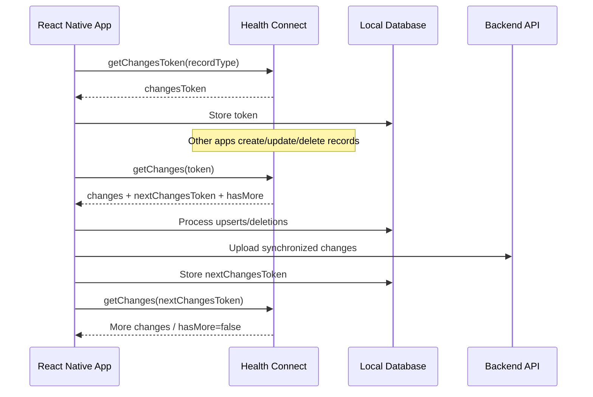

# Chapter 6 — Changes API & Data Synchronization

The **Health Connect Changes API** allows an application to synchronize incremental changes instead of repeatedly reading large historical ranges.

A Changes token represents a point in time for a selected set of Health Connect record types and optional data-origin filters. Using that token, the application can retrieve:

* New records
* Updated records
* Deleted records

The API returns another Changes token that represents the new synchronization position.

This makes the Changes API useful for:

* Local database synchronization
* Cloud/backend synchronization
* Analytics pipelines
* Wearable integrations
* Offline-first applications
* Keeping an application's own datastore synchronized with Health Connect

Health Connect recommends that applications maintain their own datastore as the application's source of truth and synchronize changes between that datastore and Health Connect. ([Android Developers][1])

---

# 6.1 Changes API Architecture

The basic synchronization flow is:



The important concept is:

```text
Token
  ↓
Get changes
  ↓
Process changes
  ↓
Get next token
  ↓
Repeat until hasMore = false
  ↓
Persist final token
```

Do **not** treat one `getChanges()` call as necessarily returning the entire backlog.

Health Connect explicitly recommends looping while `hasMore` is true. ([Android Developers][1])

---

# 6.2 Changes Token

The native Health Connect API provides:

```kotlin
healthConnectClient.getChangesToken(
    ChangesTokenRequest(
        recordTypes = setOf(
            StepsRecord::class
        )
    )
)
```

A Changes token represents a point in time from which Health Connect should report changes for the requested record types and optional data-origin filters. Tokens are valid for **30 days**. ([Android Developers][2])

### Important production recommendation

Health Connect recommends using **separate Changes tokens for independently consumed record types**.

For example:

```text
Steps       → token_steps
HeartRate   → token_heart_rate
Weight      → token_weight
Sleep       → token_sleep
```

rather than:

```text
Steps + HeartRate + Weight + Sleep
                ↓
           one token
```

Why?

Suppose the user revokes permission for `HeartRate`.

If several independent data types share one token request, that permission change can cause the request to fail. Separate tokens isolate the synchronization state for each data type. ([Android Developers][1])

---

# 6.3 React Native Changes Token (`getChanges`)

In `react-native-health-connect`, initial changes tokens are obtained by calling `getChanges()` with `recordTypes` (without passing a `changesToken`). The function returns `nextChangesToken` which represents your starting point for synchronization.

```typescript
import { getChanges } from 'react-native-health-connect';

export async function createStepsChangesToken(): Promise<string> {
  const result = await getChanges({
    recordTypes: ['Steps'],
  });

  // Store result.nextChangesToken for subsequent sync passes
  return result.nextChangesToken;
}
```

Store the token persistently in local storage (e.g. AsyncStorage or SQLite):

```typescript
type SyncState = {
  recordType: string;
  changesToken: string;
  updatedAt: string;
};
```

Example local storage state:

```text
health_sync_state

recordType       changesToken        updatedAt
--------------------------------------------------------
Steps            eyJ...              2026-09-09T...
HeartRate        eyJ...              2026-09-09T...
Weight           eyJ...              2026-09-09T...
```

---

# 6.4 Requesting Changes

Once a changes token exists, pass it to `getChanges()`:

```typescript
const response = await getChanges({
  changesToken: storedChangesToken,
});
```

`react-native-health-connect` returns a `GetChangesResults` object containing:

```typescript
{
  upsertionChanges: [
    { record: { ... } }
  ],
  deletionChanges: [
    { recordId: "..." }
  ],
  nextChangesToken: "...",
  hasMore: false,
  changesTokenExpired: false
}
```

The key properties in `GetChangesResults` are:

| Field                 | Meaning                                              |
| --------------------- | ---------------------------------------------------- |
| `upsertionChanges`    | Inserted or updated record objects                   |
| `deletionChanges`     | Array of deleted record ID objects (`{ recordId }`)   |
| `nextChangesToken`    | Token representing the next synchronization position |
| `hasMore`             | `true` if additional changes exist in the backlog    |
| `changesTokenExpired` | `true` if the token has expired (must re-sync all)   |

The native API explicitly documents `hasMore` as indicating that the returned response may not contain every available change. ([Android Developers][3])

---

# 6.5 Upsertion Changes

An upsertion represents a new or updated record.

Conceptually:

```typescript
{
  type: 'upsert',
  record: {
    recordType: 'Steps',
    count: 3200,
    startTime: '2026-09-09T09:00:00Z',
    endTime: '2026-09-09T09:45:00Z',
    metadata: {
      id: '...',
      dataOrigin: '...',
      lastModifiedTime: '...'
    }
  }
}
```

The important identifier is:

```typescript
record.metadata.id
```

For synchronization, also pay attention to:

```typescript
record.metadata.lastModifiedTime
```

Health Connect recommends using the record ID and modification time when updating the application's datastore. ([Android Developers][1])

---

# 6.6 Deletion Changes

A deletion change is different.

Conceptually:

```typescript
{
  type: 'delete',
  recordId: '11223344-5566-7788-9900-aabbccddeeff'
}
```

The critical detail is:

> A deletion change provides the Health Connect record ID, but **does not provide the record type**.

This is intentional for privacy reasons. ([Android Developers][1])

Therefore, this is a bad database design:

```text
DeletedRecord
-------------
recordId
```

if the application cannot determine which local record corresponds to that ID.

Instead, maintain a mapping:

```text
health_connect_records

healthConnectId       recordType       localId
------------------------------------------------
abc-123               Steps            local-001
def-456               HeartRate        local-002
ghi-789               Weight           local-003
```

Then:

```typescript
const localRecord =
  await db.healthConnectRecords.findByHealthConnectId(
    change.recordId
  );

if (localRecord) {
  await db.delete(localRecord.localId);
}
```

This is one of the most important implementation details in the Changes API.

Health Connect's official synchronization documentation explicitly recommends storing Health Connect IDs for this reason. ([Android Developers][1])

---

# 6.7 Complete Changes Processing Loop

A production synchronization function should continue until `hasMore` becomes false.

Conceptually:

```typescript
export async function syncChanges(
  initialToken: string
) {
  let token = initialToken;

  while (true) {
    const response = await getChanges(token);

    if (response.changesTokenExpired) {
      throw new Error(
        'HEALTH_CONNECT_CHANGES_TOKEN_EXPIRED'
      );
    }

    for (const change of response.changes) {
      if (change.type === 'upsert') {
        await processUpsert(change.record);
      }

      if (change.type === 'delete') {
        await processDelete(change.recordId);
      }
    }

    token = response.nextChangesToken;

    if (!response.hasMore) {
      break;
    }
  }

  return token;
}
```

The important sequence is:

```text
getChanges(oldToken)
        ↓
process changes
        ↓
token = nextChangesToken
        ↓
hasMore?
   ├── yes → getChanges(token)
   └── no  → persist token
```

Health Connect's own synchronization example follows this same pattern. ([Android Developers][1])

---

# 6.8 When Should the Token Be Saved?

This is a critical production concern.

Avoid this:

```typescript
const response = await getChanges(token);

await saveToken(response.nextChangesToken);

await processChanges(response.changes);
```

If the application crashes during:

```typescript
processChanges(...)
```

the token has already advanced.

The application could therefore skip changes during the next synchronization.

A safer strategy is:

```text
Read changes
      ↓
Process changes successfully
      ↓
Update local transaction/state
      ↓
Advance token
```

For example:

```typescript
await db.transaction(async (tx) => {

  for (const change of response.changes) {
    await processChange(tx, change);
  }

  await tx.syncState.update({
    recordType,
    changesToken: response.nextChangesToken,
  });

});
```

The exact transaction mechanism depends on the local database.

For a production app, token advancement and local change processing should be treated as one logical unit.

---

# 6.9 Changes Token Expiration

Changes tokens are **not permanent**.

Health Connect states that unused Changes tokens expire after **30 days**. ([Android Developers][1])

Example:

```typescript
const response = await getChanges(token);

if (response.changesTokenExpired) {
  // Token cannot be used anymore.
}
```

Do not simply create a new token and continue.

That would create a synchronization gap.

For example:

```text
Last successful sync
        ↓
       30+ days
        ↓
Token expired
        ↓
Create new token
```

If you simply create a new token, changes that occurred between the old synchronization point and the new token can be missed.

---

# 6.10 Token Expiration Recovery

When a token expires, perform a recovery synchronization.

A practical strategy is:

```text
Token expired
      ↓
Find last successful sync timestamp
      ↓
Read Health Connect records from that time
      ↓
Deduplicate/upsert records
      ↓
Create a new Changes token
      ↓
Store new token
```

For example:

```typescript
async function recoverFromExpiredToken(
  recordType: string,
  lastSyncTime: string
) {
  const records = await readRecords(
    recordType,
    {
      timeRangeFilter: {
        operator: 'between',
        startTime: lastSyncTime,
        endTime: new Date().toISOString(),
      },
    }
  );

  for (const record of records.records) {
    await upsertLocalRecord(record);
  }

  const newToken = await getChangesToken({
    recordTypes: [recordType],
  });

  await saveSyncState({
    recordType,
    changesToken: newToken,
    updatedAt: new Date().toISOString(),
  });
}
```

The exact recovery window depends on the application's consistency requirements.

Google's current guidance describes several recovery strategies, including rereading from the last known timestamp and deduplicating, or rereading a recent window such as the last 30 days. The deduplicated strategy is the preferred approach. ([Android Developers][1])

---

# 6.11 Store Both Token and Last Successful Sync Time

A production synchronization table should not store only the Changes token.

Recommended:

```typescript
type HealthConnectSyncState = {
  recordType: string;

  changesToken: string;

  lastSuccessfulSyncAt: string;

  status:
    | 'idle'
    | 'syncing'
    | 'error'
    | 'token_expired';

  updatedAt: string;
};
```

Example:

```text
Steps
------------------------------------------------
changesToken:          eyJ...
lastSuccessfulSyncAt:  2026-09-09T18:30:00Z
status:                idle
updatedAt:             2026-09-09T18:30:03Z
```

Why keep both?

Because:

```text
Changes Token
```

is optimized for incremental synchronization.

Whereas:

```text
lastSuccessfulSyncAt
```

is useful for recovery when the token becomes invalid.

---

# 6.12 Data Origin Filtering

A Changes token can optionally restrict synchronization to specific data origins.

Conceptually:

```typescript
{
  recordTypes: ['Steps'],
  dataOriginFilter: [
    'com.example.somehealthapp'
  ]
}
```

However, do not hardcode package names such as:

```typescript
'android'
```

as a universal source identifier.

Health Connect data origins should be treated as opaque identifiers supplied by Health Connect.

If your application needs to exclude records written by itself, compare the returned record's `metadata.dataOrigin` with your own package/application identity.

The official synchronization guidance also recommends avoiding re-importing upsertion changes originating from the calling application. ([Android Developers][1])

---

# 6.13 Avoiding Synchronization Loops

Suppose your application does this:

```text
App
 ↓
writes Steps to Health Connect
 ↓
Health Connect reports Steps as an upsertion
 ↓
App imports Steps
 ↓
App writes them again
 ↓
Health Connect reports another change
 ↓
...
```

This can create an unnecessary synchronization loop.

A robust design should identify the origin of records.

For example:

```typescript
if (
  record.metadata.dataOrigin === MY_PACKAGE_NAME
) {
  // Ignore if this synchronization pipeline
  // already owns the record.
  return;
}
```

Or maintain explicit synchronization metadata in your own database.

The official Health Connect synchronization guide recommends filtering out upsertion changes originating from the calling application when appropriate. ([Android Developers][1])

---

# 6.14 Background Read Permission

Health Connect supports background reading through a dedicated permission.

The Android permission is:

```xml
android.permission.health.READ_HEALTH_DATA_IN_BACKGROUND
```

Background reading should only be requested when it is genuinely required by the application's functionality.

The important distinction is:

```text
Foreground access
        ↓
User opens application
        ↓
Application reads Health Connect
```

versus:

```text
Background access
        ↓
Application is not actively open
        ↓
Application may perform permitted Health Connect reads
```

Background access is separate from ordinary Health Connect read permissions and should be handled as part of the application's permission architecture. ([Android Developers][1])

---

# 6.15 Health Connect Does Not Push Every Change to Your App

Do not design the architecture as:

```text
Health Connect
      ↓
push notification
      ↓
React Native JavaScript
```

Instead, the application periodically checks for changes.

Google's current guidance recommends checking for changes:

1. When the application becomes active in the foreground.
2. Periodically while the application remains in the foreground.
3. Through background access when the application has a legitimate need and the required permission is granted. ([Android Developers][1])

A React Native implementation can therefore use:

```typescript
import { AppState } from 'react-native';

let previousState = AppState.currentState;

AppState.addEventListener(
  'change',
  async (nextState) => {

    if (
      previousState.match(/inactive|background/) &&
      nextState === 'active'
    ) {
      await syncHealthConnect();
    }

    previousState = nextState;
  }
);
```

This is useful for foreground synchronization.

It should not be confused with a guarantee that Health Connect will continuously execute JavaScript in the background.

---

# 6.16 Recommended Synchronization Architecture

For a production React Native application:

```text
                 ┌──────────────────────┐
                 │   Health Connect     │
                 └──────────┬───────────┘
                            │
                      Changes API
                            │
                            ▼
                 ┌──────────────────────┐
                 │ HealthConnectService │
                 └──────────┬───────────┘
                            │
                    Process changes
                            │
                            ▼
                 ┌──────────────────────┐
                 │   Local Database     │
                 │                      │
                 │ records               │
                 │ HC record IDs         │
                 │ sync state            │
                 │ last sync timestamp   │
                 └──────────┬───────────┘
                            │
                       Optional
                            │
                            ▼
                 ┌──────────────────────┐
                 │     Backend API      │
                 └──────────────────────┘
```

The local database should maintain at least:

```text
health_records
-------------------------
id
health_connect_id
record_type
data_origin
start_time
end_time
last_modified_time
payload
created_at
updated_at
```

and:

```text
health_sync_state
-------------------------
record_type
changes_token
last_successful_sync_at
status
updated_at
```

---

# 6.17 Recommended Service Layer

Do not spread Health Connect synchronization logic throughout React components.

Instead:

```text
src/
├── health-connect/
│   ├── client.ts
│   ├── permissions.ts
│   ├── records.ts
│   ├── changes.ts
│   ├── aggregation.ts
│   └── sync/
│       ├── syncManager.ts
│       ├── tokenStore.ts
│       ├── changeProcessor.ts
│       └── recovery.ts
│
├── database/
│   ├── healthRecords.ts
│   └── syncState.ts
│
└── screens/
    └── HealthDashboard.tsx
```

For example:

```typescript
export class HealthConnectSyncManager {

  async syncRecordType(
    recordType: string
  ) {
    const state =
      await this.getSyncState(recordType);

    if (!state) {
      return this.initialize(recordType);
    }

    return this.processChanges(
      recordType,
      state.changesToken
    );
  }

  async initialize(
    recordType: string
  ) {
    const token =
      await getChangesToken({
        recordTypes: [recordType],
      });

    await this.saveSyncState({
      recordType,
      changesToken: token,
      lastSuccessfulSyncAt: null,
    });
  }

  async processChanges(
    recordType: string,
    token: string
  ) {
    // Process paginated changes.
    // Update local DB.
    // Persist final token.
  }
}
```

This keeps React components independent from the Health Connect synchronization mechanism.

---

# 6.18 Synchronization With a Backend

If the application also has a backend:

```text
Health Connect
      ↓
React Native
      ↓
Local DB
      ↓
Backend API
      ↓
Server DB
```

Do not attempt:

```text
Backend Server
      ↓
Health Connect
```

Health Connect is an Android device data store. The Android application acts as the bridge between Health Connect and your backend.

A robust flow is:

```text
1. React Native gets Health Connect changes
2. Process changes locally
3. Store Health Connect IDs
4. Queue backend synchronization
5. Backend receives idempotent upserts/deletes
6. Backend acknowledges
7. Local sync job marks upload complete
```

If a backend operation fails:

```text
Health Connect
      ↓
Local DB
      ↓
Upload Queue
      ↓
Backend
      ↓
Retry
```

This is where a queue such as BullMQ can be useful on the **backend side**, but it is not a replacement for Health Connect's Changes API.

---

# 6.19 Idempotency

Backend synchronization must be idempotent.

Suppose the application sends:

```json
{
  "healthConnectId": "abc-123",
  "recordType": "Steps",
  "count": 3200
}
```

twice.

The server should not create two logical records.

Instead:

```text
healthConnectId + recordType
                ↓
            unique key
```

can be used to implement an idempotent upsert.

For updates, also consider:

```text
lastModifiedTime
```

so an older synchronization event does not overwrite a newer one.

---

# 6.20 Complete Production Sync Algorithm

A robust synchronization algorithm looks like this:

```text
START
  │
  ▼
Load sync state
  │
  ├── No token ──────────────► Initial sync
  │                              │
  │                              ▼
  │                         Read required data
  │                              │
  │                              ▼
  │                         Create token
  │
  ▼
Call getChanges(token)
  │
  ├── Token expired ─────────► Recovery sync
  │
  ▼
Process changes
  │
  ├── Upsert ────────────────► Local DB upsert
  │
  └── Delete ────────────────► Local DB delete
  │
  ▼
Persist nextChangesToken
  │
  ▼
hasMore?
  │
  ├── YES ───────────────────► getChanges(nextToken)
  │
  └── NO
  │
  ▼
Update lastSuccessfulSyncAt
  │
  ▼
Optional backend synchronization
  │
  ▼
END
```

---

# 6.21 Important Production Rules

### Rule 1 — Never assume one Changes request is enough

Always check:

```typescript
response.hasMore
```

and continue processing until it becomes false. ([Android Developers][1])

### Rule 2 — Store the Health Connect record ID

Especially because:

```text
DeletionChange
      ↓
recordId only
```

The deletion does not contain the record type. ([Android Developers][1])

### Rule 3 — Store a recovery timestamp

Keep:

```text
lastSuccessfulSyncAt
```

in addition to the token.

### Rule 4 — Handle token expiration

Tokens expire after 30 days. ([Android Developers][2])

### Rule 5 — Use separate tokens for independently consumed data types

For example:

```text
Steps       → token A
HeartRate   → token B
Weight      → token C
```

This makes permission failures easier to isolate. ([Android Developers][1])

### Rule 6 — Don't re-import your own writes

Use metadata/data origin to avoid synchronization loops where appropriate. ([Android Developers][1])

### Rule 7 — Don't advance the token before processing succeeds

Conceptually:

```text
Process
  ↓
Commit
  ↓
Advance token
```

not:

```text
Advance token
  ↓
Process
```

### Rule 8 — Don't depend on continuous background JavaScript

Foreground lifecycle synchronization is an important baseline, while background reads require the appropriate Health Connect permission and platform configuration. ([Android Developers][1])

---

# 6.22 Chapter Summary

The Health Connect Changes API provides an efficient incremental synchronization mechanism.

The essential lifecycle is:

```text
getChangesToken()
        ↓
getChanges(token)
        ↓
process upserts/deletions
        ↓
nextChangesToken
        ↓
hasMore?
        ↓
repeat
        ↓
persist final token
```

For production applications:

```text
Changes API
     +
Local database
     +
Health Connect record IDs
     +
Last successful sync timestamp
     +
Token-expiration recovery
     +
Idempotent backend synchronization
```

provides a significantly more reliable architecture than repeatedly reading large historical ranges.

The most important detail to remember is that **a Changes token is a synchronization cursor, not a permanent database checkpoint**. It expires after 30 days, so your application must have a recovery strategy. ([Android Developers][1])

[1]: https://developer.android.com/health-and-fitness/health-connect/sync-data "Synchronize data | Android Developers"
[2]: https://developer.android.com/reference/kotlin/androidx/health/connect/client/HealthConnectClient "HealthConnectClient API reference | Android Developers"
[3]: https://developer.android.com/reference/androidx/health/connect/client/HealthConnectClient "HealthConnectClient API reference | Android Developers"
